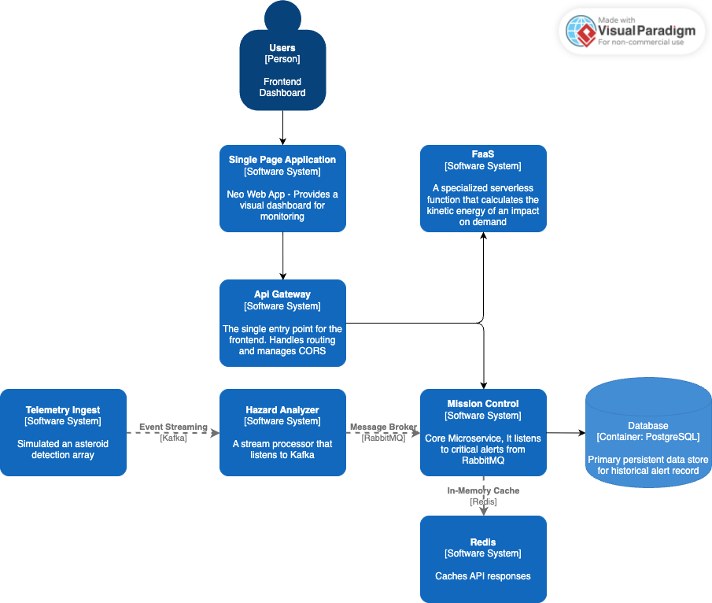

# neo-sentinel
Event-Driven, Polyglot Microservices Architecture

## Overview

Neo Sentinel is a distrivuted microservice designed architecture made to safeguard Earth from incoming asteroids. The system ingests telemetry data from simulated asteroid detection arrays, processing it in real time to identify collision hazards and dustributes critical alerts to a web-based microfrontend dashboard.

## Architectural Design

## System Logic and Data Flow

- Ingestion: the `TelemetryProducer` generates asteroid data and pushed it to the Kafka stream
- Analysis: the `HazardService` subscribes to the stream and flags asteroids with `Collission Warning`
- Persistance: `MissionCommander` listens to the RabbitMQ queue, converts the message into an Alert entity and saves it to PostgreSQL.
- Retrieval: Alerts are sent to the dashboard via the `APIGateway`
- Caching: happens through `Redis`